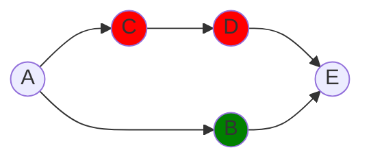

# Satoshi subway simulator

Programming task as part of the Buda.com job application.

## Topology file structure
One of the input parameters for the script corresponds to the file **networkTopololy.json**, which has the following structure:

 Three keys corresponding to:

 - [ ] The **adjacentStations** key is an object that  contains a set of key:value elements, which describe the adjacencies in the network. If it has more than one adjacency, they are separated by commas.

 - [ ] The **redStation** key represents a string of the red station names, separated by commas, the **greenStation** key behaves equal.

For example, for the following typology you have the file:



```javascript
{
    "adjacentStations": {        
        "A": "B,C",
        "B": "A,E",
        "C": "A,D",
        "D": "C,E",
        "E": "D,B"
    },
    "redStation" : "C,D",
    "greenStation": "B" 
}
```

## Installation
    python -m pip install --user virtualenv 
    python -m venv env
    .\env\Scripts\activate
    pip install -r requirements.txt

## Execution
    python ./main.py

## Automated test
    pytest -v